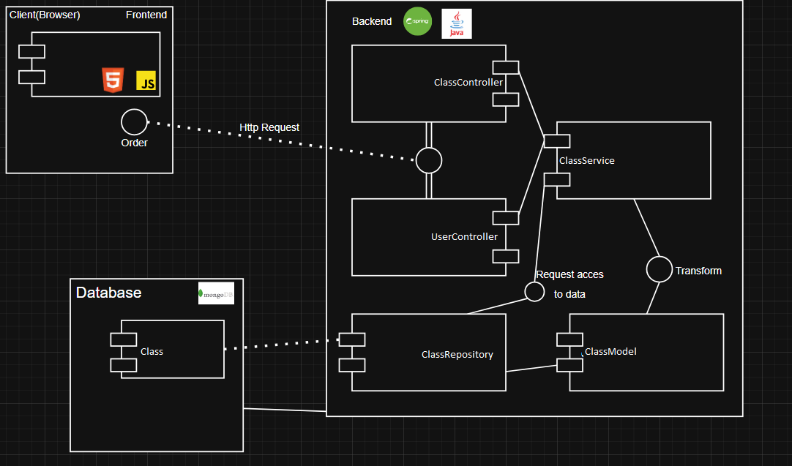
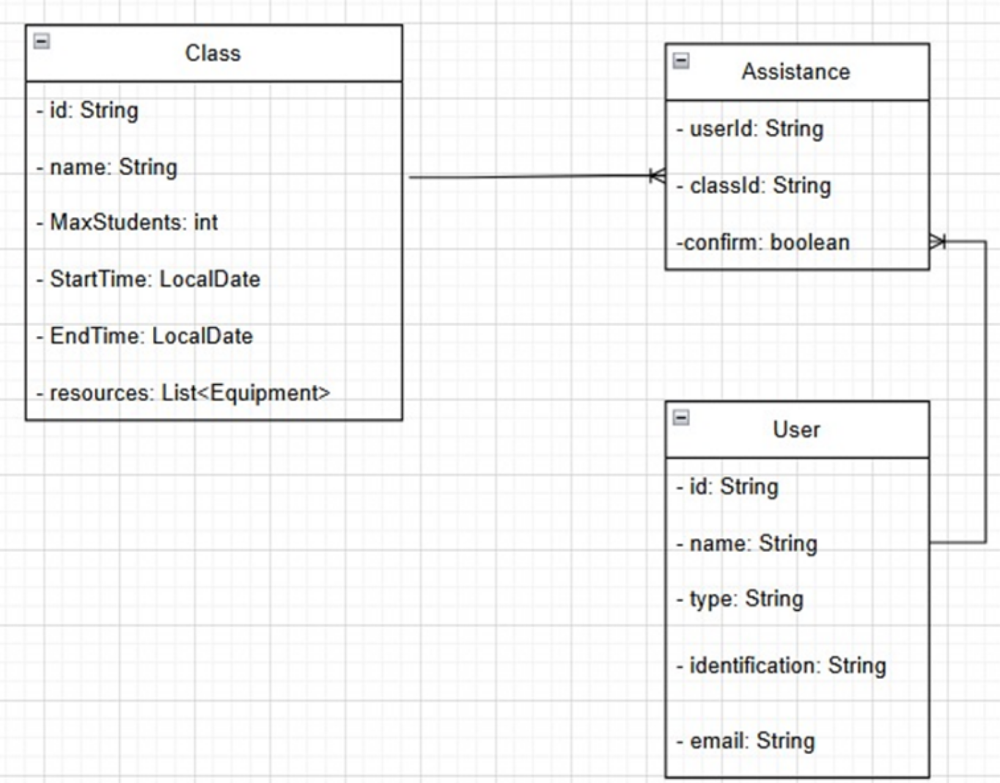
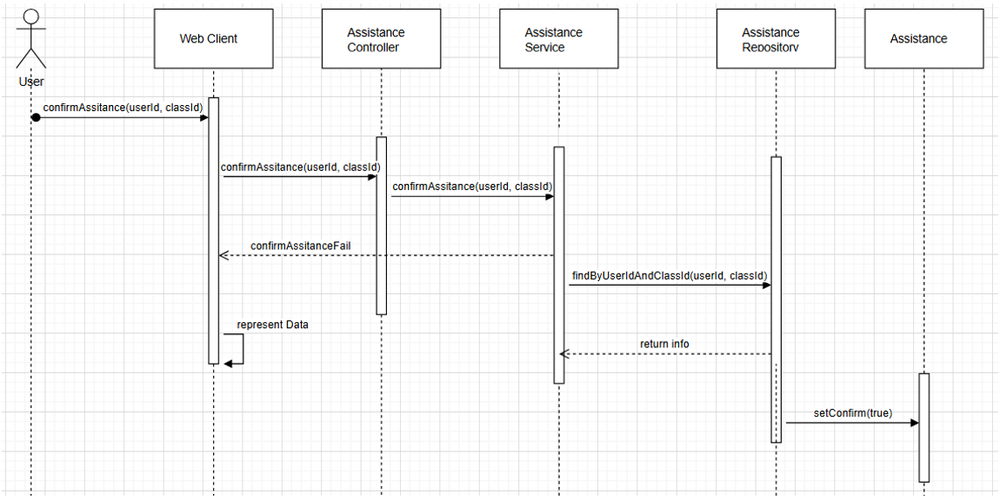
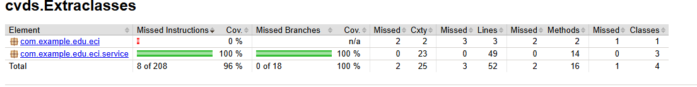
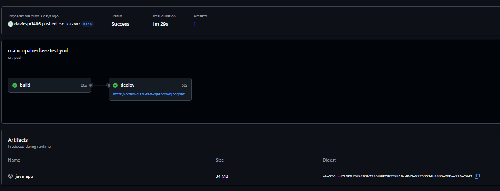
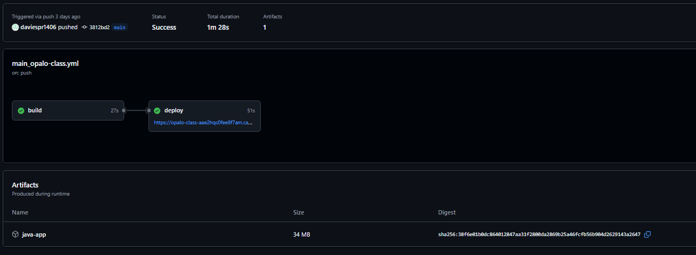

# 🎓 Microservice: Extracurricular Class Attendance

This microservice manages the registration, consultation, and monitoring of attendance to extracurricular classes at a university, as part of the University Wellness module.

---

## 👥 Authors

- *Emily Noreña Cardozo*  
  GitHub: [EmilyNorena](https://github.com/EmilyNorena)

- *David Santiago Espinosa Rojas*  
  GitHub: [daviespr1406](https://github.com/daviespr1406)

- *Mayerlly Suárez Correa*  
  GitHub: [mayerllyyo](https://github.com/mayerllyyo)

---

## 🧩 Data Model (MongoDB)

```plaintext
┌────────────────────┐        ┌────────────────────────┐
│     usuarios       │        │ extracurricularClasses │
├────────────────────┤        ├────────────────────────┤
│ _id                │        │ _id                    │
│ nombreCompleto     │        │ nombre                 │
│ tipoUsuario        │        │ tipoActividad          │ 
│ identificacion     │        │ capacidadMaxima        │
│ email              │        │ fechaInicio/fechaFin   │
└────────────────────┘        │ recursos[]             │
         ▲                    └────────┬───────────────┘
         │                             │
         │                    ┌────────▼───────────────┐
         │                    │       asistencias      │
         │                    ├────────────────────────┤
         └────────────────────┤ usuarioId              │
                              │ claseId                │
                              │ fechaHora              │
                              │ confirmada             │
                              └────────────────────────┘
```

---

## ▶️ Steps to Run

1. Clone the repository:
   ```bash
   git clone https://github.com/ECIBienestar/opalo-extraclasses
   cd opalo-extraclasses
   ```

2. Configure database connection in `application.properties`:
   ```properties
   spring.data.mongodb.uri=
   spring.data.mongodb.database=
   ```

3. Build and run the application:
   ```bash
   mvn clean install
   mvn spring-boot:run
   ```

---

## 🛠️ Technologies Used

- *Java 17*
- *Spring Boot 3.x* (Spring Security, Spring Web)
- *MongoDB* (NoSQL Database)
- *Maven*
- *Lombok*
- *JUnit 5 & Mockito* (for testing)
- *JaCoCo* (for code coverage)
- *SonarCloud* (for code quality)
- *JWT* (for secure authentication)

---

## 📄 MongoDB Document Examples

### `clasesExtracurriculares`

```json
{
  "_id": ObjectId("644a8e64e77b5f001e5d15df"),
  "nombre": "Yoga al aire libre",
  "tipoActividad": "RELACION",
  "capacidadMaxima": 20,
  "fechaInicio": ISODate("2025-04-25T18:00:00Z"),
  "fechaFin": ISODate("2025-06-25T19:00:00Z"),
  "recursos": [
    {
      "nombre": "Colchonetas",
      "tipo": "implemento",
      "disponibilidad": {
        "2025-04-25": true,
        "2025-04-27": false
      }
    },
    {
      "nombre": "Salón 2",
      "tipo": "salon",
      "disponibilidad": {
        "2025-04-25": true
      }
    }
  ]
}
```

### `asistencias`

```json
{
  "_id": ObjectId("644a8ec8e77b5f001e5d15e0"),
  "usuarioId": "644a8e20e77b5f001e5d15de",
  "claseId": "644a8e64e77b5f001e5d15df",
  "fechaHora": ISODate("2025-04-25T18:00:00Z"),
  "confirmada": true
}
```

### `notificaciones`

```json
{
  "_id": ObjectId("644a8efee77b5f001e5d15e1"),
  "usuarioId": "644a8e20e77b5f001e5d15de",
  "tipo": "RECORDATORIO",
  "mensaje": "No olvides tu clase de Yoga a las 18:00",
  "fechaEnvio": ISODate("2025-04-25T12:00:00Z"),
  "enviado": true
}
```

### `reportes`

```json
{
  "_id": ObjectId("644a8f3ae77b5f001e5d15e2"),
  "tipo": "POR_USUARIO",
  "parametros": {
    "usuarioId": "644a8e20e77b5f001e5d15de",
    "rangoFechas": {
      "inicio": ISODate("2025-04-01T00:00:00Z"),
      "fin": ISODate("2025-04-30T23:59:59Z")
    }
  },
  "contenido": "https://api.universidad.edu/reportes/usuario/644a8e20e77b5f001e5d15de/abril2025.pdf",
  "fechaGeneracion": ISODate("2025-04-25T20:00:00Z")
}
```

---

## ⚙️ Microservice Components

```plaintext
┌────────────────────────────┐
│       REST API             │
├────────────────────────────┤
│ POST   /asistencias        │
│ GET    /asistencias/user   │
│ GET    /reportes           │
│ POST   /clases             │
│ POST   /notificaciones     │
└────────────────────────────┘

       ▼

┌────────────────────────────┐
│         Services           │
├────────────────────────────┤
│ AsistenciaService          │
│ ClaseService               │
│ NotificacionService        │
│ ReporteService             │
│ RecursoService             │
└────────────────────────────┘

       ▼

┌────────────────────────────┐
│      Mongo Repositories    │
├────────────────────────────┤
│ UsuarioRepository          │
│ ClaseRepository            │
│ AsistenciaRepository       │
│ NotificacionRepository     │
│ ReporteRepository          │
└────────────────────────────┘

       ▼

┌────────────────────────────┐
│    Scheduled Tasks         │
├────────────────────────────┤
│ Automatic reminders        │
│ Post-session confirmations │
│ Report generation          │
└────────────────────────────┘
```



---
### 📦 Integration with Other Modules

- Connect with central user service for authentication and user info
- Consume scheduling microservice for conflict validation
- Generate events for notification microservice

### 🏗️ Architecture Document

- [x] Explain layered structure
- [x] Show flow from controller to repository
- [x] Indicate external service interactions

### 📝 Requirements Analysis

- [ ] Functional requirements
- [ ] Non-functional requirements (performance, scalability, security)

### 📚 Class Diagram


This class diagram represents an extracurricular class attendance management module, designed to record, view, and manage user (student, teacher, etc.) participation in activities such as sports, cultural workshops, and so on.


Brief description of the classes:
- Class: Models an extracurricular class with: id (unique identifier), name (activity name), MaxStudents (maximum student capacity), StartTime/EndTime (start and end dates and times), and resources: List of required resources (supplies, equipment, etc.).
- Attendance: Records a user's attendance in a class with: userId (ID of the user who attended), classId (ID of the class attended), and confirm (attendance confirmation status).
- User: Represents a system user with: id (unique identifier), name (full name), type (user role: Student, Teacher, Administrative), identification (identification document), and email (email address).

### 🔁 Sequence Diagram

 
- Process Start (User): The user initiates the action by requesting attendance confirmation using the confirmAssistance(userId, classId) operation from the web client interface.
- Web Client → Controller: The web client sends the request to the Assistance Controller, passing the userId and classId as parameters.
- Controller → Service: The Assistance Controller forwards the request to the Assistance Service, which handles the business logic related to the confirmation.
- Service → Repository: The Assistance Service queries the Assistance Repository using the findByUserIdAndClassId(userId, classId) method to verify if an attendance record exists for the user in the corresponding class.
- Repository → Service: The repository returns the found information to the Assistance Service.
- Service → Assistance Entity: If the record is found, the service marks the attendance as confirmed by calling the setConfirm(true) method on the Assistance entity.

Return result: If the confirmation is successful, the system returns the representative data to the web client. Otherwise, the controller returns an error message (ConfirmAssistanceFail) to the client.

### 📘 Swagger Documentation

- [Swagger on Azure](https://opalo-class-aae2hqc0fee9f7am.canadacentral-01.azurewebsites.net/swagger-ui/index.html)

### 😊 Happy Path

- [x] User enrolls in class
- [ ] Receives notification
- [x] Attends session
- [x] Attendance is confirmed

### ⚠️ Error Handling

- [x] Duplicate enrollment
- [x] Class full
- [x] Database errors
- [ ] Unauthorized access

### 🧪 Test Evidence

- [x] Unit test results
- [x] Integration test logs
- [x] JaCoCo coverage report
### JaCoCo Coverage Report



### 🔄 CI/CD and Deployment Evidence

- [x] GitHub Actions workflows
- [ ] SonarCloud analysis link
- [x] Azure deployment logs/screenshots

### CI/CD Test Pipeline

### CI/CD Production Pipeline



### 📁 Project Structure

```plaintext
src/
├── config/
├── controllers/
├── dto/
├── exceptions/
├── models/
├── repositories/
├── security/
├── services/
└── utils/
```
