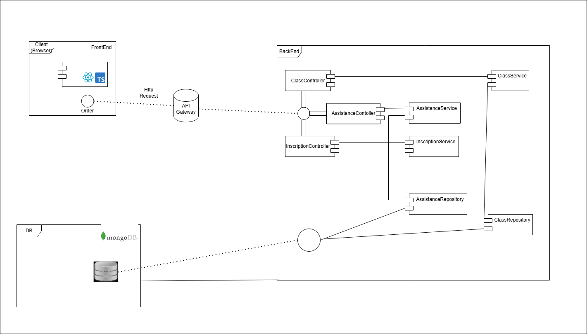

# 🎓 Microservicio: Asistencia a Clases Extracurriculares

Este microservicio gestiona el registro, consulta y seguimiento de la asistencia a clases extracurriculares de una universidad, como parte del módulo de Bienestar Universitario.

---

## 👥 Autores
- David Santiago Espinosa Rojas
- Emily Noreña Cardozo
- Mayerlly Suarez Correa

## 🧩 Modelo de Datos (MongoDB)

```plaintext
┌────────────────────┐        ┌────────────────────────┐
│     usuarios       │        │  clasesExtracurriculares│
├────────────────────┤        ├────────────────────────┤
│ _id                │        │ _id                    │
│ nombreCompleto     │        │ nombre                 │
│ tipoUsuario        │        │ tipoActividad          │
│ identificacion     │        │ capacidadMaxima        │
│ email              │        │ fechaInicio/fechaFin   │
└────────────────────┘        │ recursos[]             │
         ▲                    └────────┬───────────────┘
         │                             │
         │                    ┌────────▼───────────────┐
         │                    │       asistencias      │
         │                    ├────────────────────────┤
         └────────────────────┤ usuarioId              │
                              │ claseId                │
                              │ fechaHora              │
                              │ confirmada             │
                              └────────────────────────┘

┌────────────────────┐        ┌────────────────────────┐
│   notificaciones   │        │        reportes        │
├────────────────────┤        ├────────────────────────┤
│ _id                │        │ _id                    │
│ usuarioId          │        │ tipo                   │
│ tipo               │        │ parametros             │
│ mensaje            │        │ contenido              │
│ fechaEnvio         │        │ fechaGeneracion        │
└────────────────────┘        └────────────────────────┘
```

---

## 📄 Ejemplos de Documentos en MongoDB


---
### Steps to Run

1. Clone the repository:
   ```bash
   git clone https://github.com/ECIBienestar/opalo-extraclasses
   cd opalo-extraclasses
   ```

2. Configure database connection in `application.properties`:
   ```properties
   spring.data.mongodb.uri=
   spring.data.mongodb.database=
   ```

3. Build and run the application:
   ```bash
   mvn clean install
   mvn spring-boot:run
   ```
---
=======

### `clasesExtracurriculares`

```json
{
  "_id": ObjectId("644a8e64e77b5f001e5d15df"),
  "nombre": "Yoga al aire libre",
  "tipoActividad": "RELACION",
  "capacidadMaxima": 20,
  "fechaInicio": ISODate("2025-04-25T18:00:00Z"),
  "fechaFin": ISODate("2025-06-25T19:00:00Z"),
  "recursos": [
    {
      "nombre": "Colchonetas",
      "tipo": "implemento",
      "disponibilidad": {
        "2025-04-25": true,
        "2025-04-27": false
      }
    },
    {
      "nombre": "Salón 2",
      "tipo": "salon",
      "disponibilidad": {
        "2025-04-25": true
      }
    }
  ]
}
```

---

### `asistencias`

```json
{
  "_id": ObjectId("644a8ec8e77b5f001e5d15e0"),
  "usuarioId": "644a8e20e77b5f001e5d15de",
  "claseId": "644a8e64e77b5f001e5d15df",
  "fechaHora": ISODate("2025-04-25T18:00:00Z"),
  "confirmada": true
}
```

---

### `notificaciones`

```json
{
  "_id": ObjectId("644a8efee77b5f001e5d15e1"),
  "usuarioId": "644a8e20e77b5f001e5d15de",
  "tipo": "RECORDATORIO",
  "mensaje": "No olvides tu clase de Yoga a las 18:00",
  "fechaEnvio": ISODate("2025-04-25T12:00:00Z"),
  "enviado": true
}
```

---

### `reportes`

```json
{
  "_id": ObjectId("644a8f3ae77b5f001e5d15e2"),
  "tipo": "POR_USUARIO",
  "parametros": {
    "usuarioId": "644a8e20e77b5f001e5d15de",
    "rangoFechas": {
      "inicio": ISODate("2025-04-01T00:00:00Z"),
      "fin": ISODate("2025-04-30T23:59:59Z")
    }
  },
  "contenido": "https://api.universidad.edu/reportes/usuario/644a8e20e77b5f001e5d15de/abril2025.pdf",
  "fechaGeneracion": ISODate("2025-04-25T20:00:00Z")
}
```

---

## ⚙️ Componentes del Microservicio

```plaintext
┌────────────────────────────┐
│       API REST             │
├────────────────────────────┤
│ POST   /asistencias        │
│ GET    /asistencias/user   │
│ GET    /reportes           │
│ POST   /clases             │
│ POST   /notificaciones     │
└────────────────────────────┘

       ▼

┌────────────────────────────┐
│       Servicios            │
├────────────────────────────┤
│ AsistenciaService          │
│ ClaseService               │
│ NotificacionService        │
│ ReporteService             │
│ RecursoService             │
└────────────────────────────┘

       ▼

┌────────────────────────────┐
│     Repositorios (Mongo)   │
├────────────────────────────┤
│ UsuarioRepository          │
│ ClaseRepository            │
│ AsistenciaRepository       │
│ NotificacionRepository     │
│ ReporteRepository          │
└────────────────────────────┘

       ▼

┌────────────────────────────┐
│    Tareas programadas      │
├────────────────────────────┤
│ Recordatorios automáticos  │
│ Confirmaciones post-sesión │
│ Generación de reportes     │
└────────────────────────────┘
```

---



## 🛠️ Tecnologías sugeridas

- Java + Spring Boot
- MongoDB (NoSQL)
- Spring Data MongoDB
- JWT para autenticación
- Scheduler de Spring para tareas automáticas
- Apache PDFBox o JasperReports para reportes
